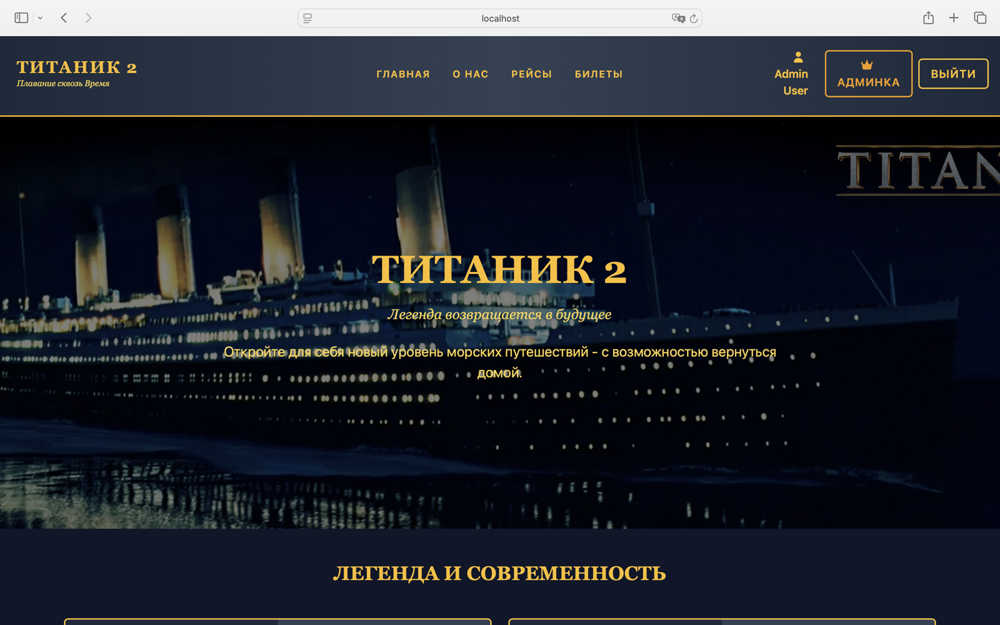
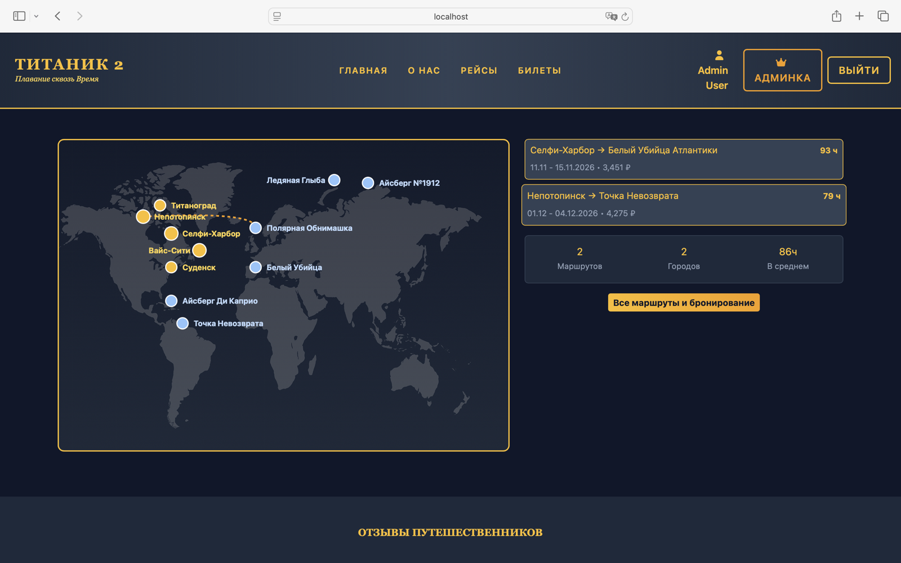
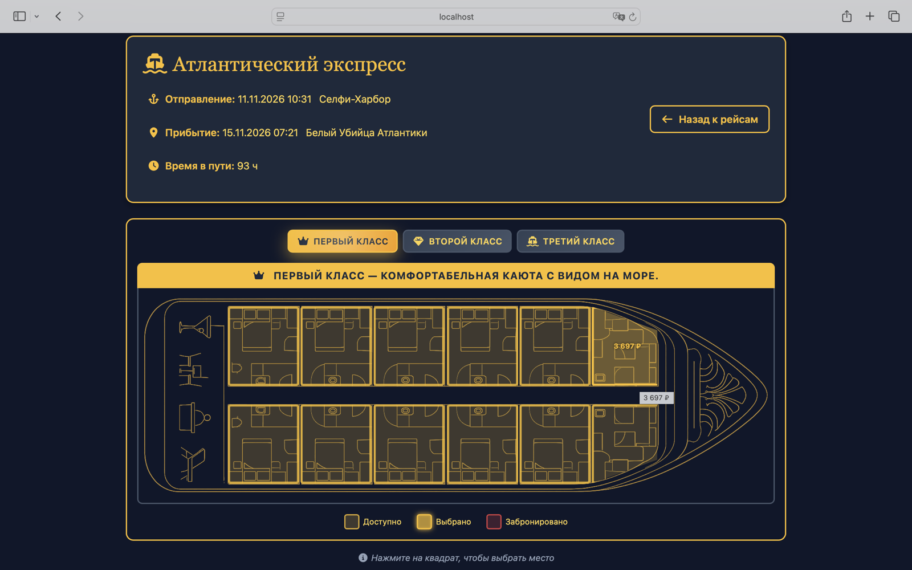
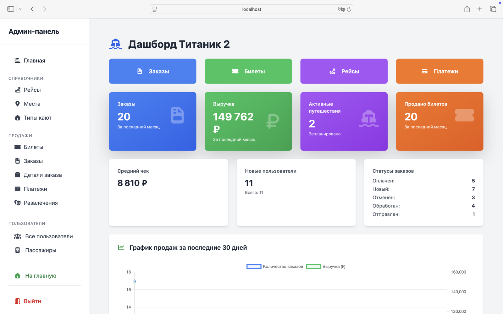

<div align="center">

# Titanic II — бронирование кают

**Веб-приложение для продажи билетов на круизный лайнер**

[](https://laravel.com)
[](https://php.net)
[](https://mysql.com)
[](https://docker.com)
[](https://tailwindcss.com)

</div>

---

## О проекте

Учебный проект: сайт круизной компании, где пользователь выбирает рейс, бронирует
конкретную каюту на схеме палубы, вносит данные пассажиров и оплачивает заказ.
Есть личный кабинет с историей поездок и админ-панель с управлением рейсами,
билетами, заказами и дашбордом продаж.

Разрабатывался командой из трёх человек, 109 коммитов. Инфраструктура целиком
в Docker: nginx, PHP-FPM, MySQL, phpMyAdmin и отдельный контейнер под cron.

---

## Скриншоты

**Главная**



**Маршруты и рейсы** — карта портов, расписание, цены



**Выбор каюты** — схема палубы, три класса обслуживания, статусы мест



**Админ-панель** — дашборд с метриками, статусами заказов и графиком продаж



---

## Мой вклад

58 коммитов из 109, сентябрь — декабрь 2025. Проект командный, поэтому разделяю
то, что делал целиком, и то, где работали вместе.

**Полностью моё**

- **Магазин и бронирование** — `ShopController`, выбор кают на интерактивных схемах
  палуб для трёх классов, оформление заказа, ввод данных пассажиров и карты, оплата
- **Система лояльности** — уровни, расчёт скидки, применение к заказу
- **Освобождение просроченных броней** — консольная команда и cron-контейнер
- **Страница пассажиров** в админ-панели

**В основном моё**

- **Личный кабинет** — история заказов, детали заказа, билеты пользователя

**Совместно с командой**

- **Админ-панель** — участвовал в разделах и дашборде, бо́льшую часть вёрстки
  админки делал [justaguy0-0](https://github.com/justaguy0-0)
- **Главная страница** — правки втроём

**Кроме того** — модели, миграции и сидеры, роли и права через Spatie Permission,
middleware для разграничения доступа.

---

## Как устроено бронирование

Основная сложность любой системы продажи билетов — не продать одно место дважды
и при этом не заморозить его навсегда, если человек передумал на этапе оплаты.

Решение:

1. При оформлении заказа билеты переводятся в статус `Забронировано`, заказ — в `Новый`
2. Другим пользователям эти места больше не показываются свободными
3. Отдельный контейнер с cron раз в минуту запускает планировщик Laravel
4. Команда `orders:clear-expired` находит заказы в статусе `Новый` старше **10 минут**,
   отменяет их и возвращает билетам статус `Доступно`

Освобождение идёт внутри транзакции с откатом при ошибке: либо заказ отменён и все
его билеты свободны, либо не изменилось ничего.

```php
// app/Console/Commands/ClearExpiredOrders.php
$expiredOrders = Order::where('status', 'Новый')
    ->where('created_at', '<=', now()->subMinutes(10))
    ->with('orderItems.ticket')
    ->get();
```

---

## Система лояльности

Уровень считается по числу билетов в **оплаченных** заказах и пересчитывается после
каждой успешной оплаты. Скидка применяется к сумме заказа автоматически, на странице
заказа видно прогресс до следующего уровня.

| Уровень | Условие | Скидка |
|---|---|---|
| 1 | до 5 билетов | — |
| 2 | от 5 билетов | 10% |
| 3 | от 10 билетов | 20% |

---

## Возможности

**Для пользователя**
- Каталог рейсов с картой портов, расписанием и ценами
- Выбор конкретной каюты на схеме палубы, три класса обслуживания
- Оформление заказа с данными пассажиров
- Оплата с учётом скидки по уровню лояльности
- Личный кабинет: заказы, билеты, история
- Страницы развлечений на борту и поддержки

**Для администратора**
- Дашборд: заказы, выручка, средний чек, статусы заказов, график продаж за 30 дней
- Управление рейсами, портами, типами кают и билетами
- Заказы, позиции заказов, платежи, пассажиры
- Развлечения и пользователи
- Разграничение доступа по ролям

---

## Технологии

| Слой | Инструменты |
|---|---|
| Бэкенд | Laravel 12, PHP 8.2 |
| База данных | MySQL 8.0, Eloquent ORM, миграции и сидеры |
| Права доступа | Spatie Laravel Permission |
| Авторизация | Laravel Breeze |
| Фронтенд | Blade, Tailwind CSS, Vite |
| Инфраструктура | Docker Compose — nginx, PHP-FPM, MySQL, phpMyAdmin, cron |
| Отладка | Laravel Telescope, Laravel Pint |

---

## Структура

```
src/
├── app/
│   ├── Console/Commands/     # ClearExpiredOrders — освобождение просроченных броней
│   ├── Http/Controllers/
│   │   ├── Admin/            # 11 разделов админ-панели
│   │   ├── ShopController    # выбор мест, заказ, оплата, лояльность
│   │   ├── ProfileController # личный кабинет
│   │   └── VoyageController  # рейсы
│   └── Models/               # Voyage, Ticket, CabinType, Order, OrderItem,
│                             # Payment, Passenger, Place, Entertainment, User
├── database/
│   ├── migrations/
│   └── seeders/
├── resources/views/          # Blade-шаблоны
└── routes/web.php
```

---

## Запуск

Нужен только Docker.

**1. Поднять контейнеры**

```bash
docker-compose up -d
```

**2. Установить зависимости и собрать фронтенд**

```bash
docker-compose run --rm composer install
docker-compose run --rm node npm install
docker-compose run --rm node npm run build
```

**3. Настроить приложение**

```bash
cp src/.env.example src/.env
docker-compose run --rm artisan key:generate
docker-compose run --rm artisan migrate --seed
```

Сайт — `http://localhost:8000`, phpMyAdmin — `http://localhost:8080`.

Тестовые учётные записи создаются сидерами:

| Роль | Логин | Пароль |
|---|---|---|
| Администратор | `admin@example.com` | `password` |
| Пользователь | любой из сгенерированных | `password` |

---

## Команда

| Участник | Основные направления |
|---|---|
| [justaguy0-0](https://github.com/justaguy0-0) | админ-панель, каталог рейсов, общая сборка проекта |
| [Danila Valov](https://github.com/sliven1) | магазин и бронирование, оплата, лояльность, личный кабинет |
| [ynat28](https://github.com/ynat28) | вёрстка отдельных страниц |
